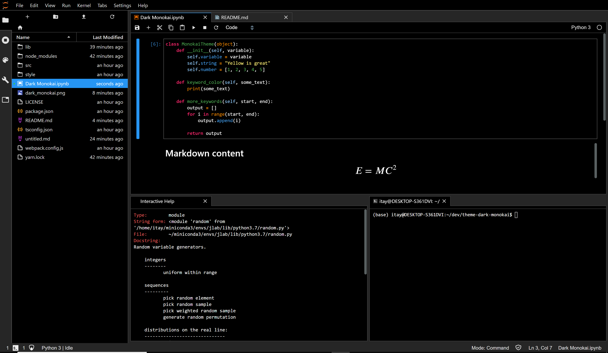

# Dark Monokai Theme

A dark Monokai theme extension for JupyterLab. I use JLab quite extensively for development and always wanted a darker theme based on Monokai. If you like pitch black backgrounds with high contrast colours, this theme is for you.

** Important: Dark Monokai is compatible with JupyterLab version > 1.0.0 **

[note for this branch] Changed the selection color a little bit brighter.



## Prerequisites

* JupyterLab

## Installation

```bash
# jupyter labextension install theme-dark-monokai
```

[note]: This command is not valid as of March 2020. Please use the way of Development installation described below.

## Development

For a development install (requires npm version 4 or later), do the following in the repository directory:

```bash
npm install
jupyter labextension link .
```

To rebuild the package and the JupyterLab app:

```bash
npm run build
jupyter lab build
```
